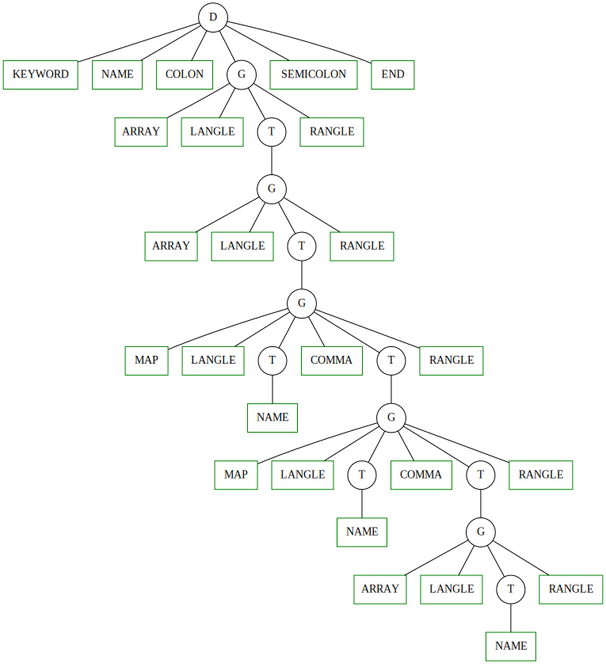

# Лабораторная работа \#2

## 1. Разработка грамматики

> Вариант 11. Описание массивов в Kotlin
> 
> Массив в Kotlin. Описание начинается ключевым словом “var”, далее идет имя массива, двоеточие, имя типа “Array”, далее в угловых скобках имя типа элементов массива.
> Используйте один терминал для всех имен переменных и имен типов.
> Используйте один терминал для ключевого слова var (не несколько ‘v’, ‘a’, ‘r’).
>
> Пример: var x: Array<Int>;

Грамматика:
```
D -> K N : Array < T > ;
K -> keyword
T -> name
T -> < T >
```
Где:
  * ```D``` -- нетерминал, соотвествует полностью заданному описанию массива.
  * ```K``` -- нетерминал, соответствует ключевому слову.
  * ```T``` -- нетерминал, соотвествует названию типа, либо параметризации массива.
  * ```keyword (KEYWORD)``` -- терминал, задает ключевое слово, в данной работе -- только ```"var"```.
  * ```name (NAME)``` -- терминал, задает либо имя переменной, либо имя типа, кроме имени типа ```Array```.
  * ```: (COLON)``` -- терминал, задает символ двоеточия.
  * ```Array (ARRAY)``` -- терминал, задает одноименное имя типа, и только его.
  * ```< (LANGLE)``` -- терминал, задает символ левой треугольной скобки.
  * ```> (RANGLE)``` -- терминал, задает символ правой треугольной скобки.
  * ```; (SEMICOLON)``` -- терминал, задает символ точки с запятой.

В этой грамматике нет ни левой рекурсии, ни правого ветвления. Однако в первоначальном варианте, я рассматривал терминалы ```name``` и ```Array``` как один, из-за чего появлялось правое ветвление, но и как следствие, некоторая бесмысслица в обозначении.

## 2.  Построение лексического анализатора
  
Жадно набирает символы, пока не встретит пробел, конец строки, либо один из специальных символых, которыми не могут быть названы имена типов и переменных в Kotlin -- ```,;[]/<>:\```. После определит соотвествующий токен для выделенной строки. (```"var"``` -- это токен ```keyword```, ```"Array"``` -- это токен ```Array```, аналогично строки соответствующие односимвольным токенам грамматики.

[Код лексического анализатора](KotlinArray/lexical-analyzer/) 
  
## 3. Построение синтаксического анализатора

Множества FIRST и FOLLOW для нетерминалов грамматики:
| | FIRST | FOLLOW |
|-|-|-|
|D| KEYWORD | END |
|K| KEYWORD | NAME |
|T| ARRAY NAME | RANGLE |

[Код, считающий эти множества](KotlinArray/helpers/)
  
## 4 Визуализация дерева разбора

[Код парсера](KotlinArray/parser/)

Для визуализации дерева разбора возпользовался тулзой GraphViz. Добавил в класс дерева метод [walkthroughGraphViz](KotlinArray/parser/Tree.cpp#L44), который генерирует конфиг нужного формата, для запуска. С помощью [скрипта](KotlinArray/visualizer/build_graph.sh) можно получить svg файл:

Пример разбора строки ```var array: Array<Array<Int>>;```:


  
## 5 Подготовка набора тестов
  
25 корректных и неккоректных тестов с комментариями [здесь](KotlinArray/tests.cpp#L79).
