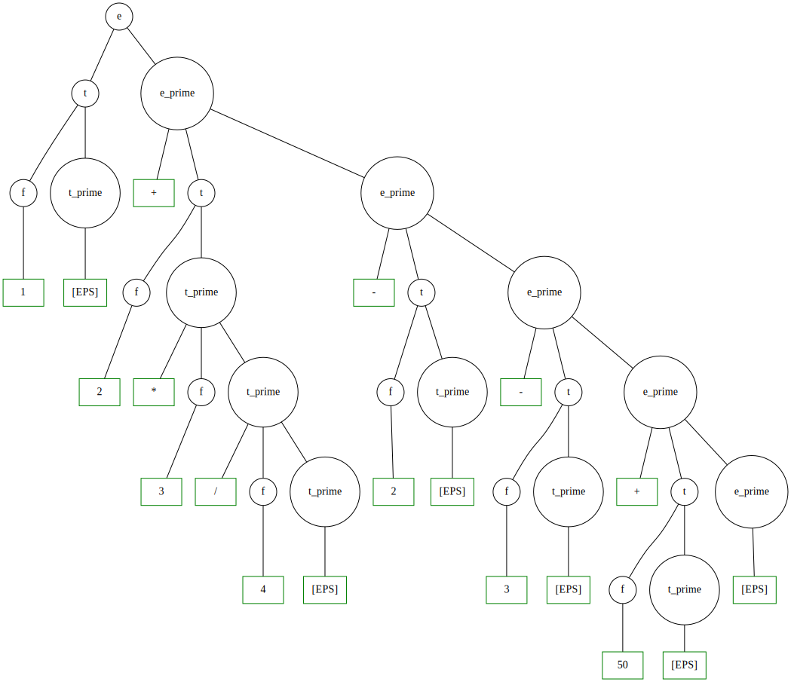
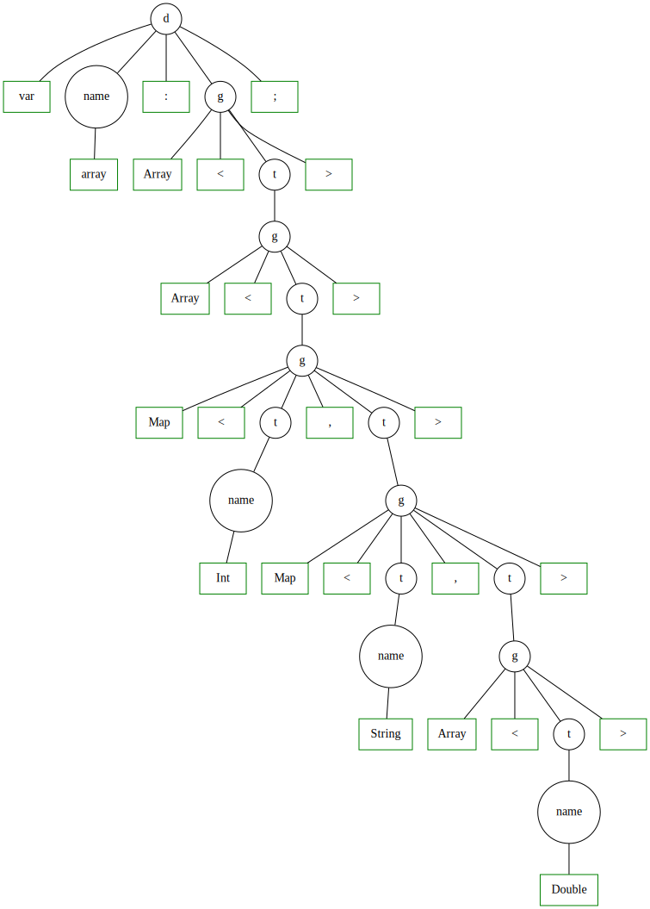

# Генератор трансляторов

Позволяет транслировать заданную строку по заданной граматике. Для работы требуется только специфицировать файл с грамматикой ([примеры](TranslatorGenerator/sample)) и, опционально, [файл с описанием тел транслирующих символов](TranslatorGenerator/src/main/java/parser/Utils.java).

Реализованны следующие пункты:
* (10 баллов) LL(1)-грамматики, нисходящий разбор;
* (10 баллов) поддержка синтезируемых атрибутов;
* (10 баллов) поддержка наследуемых атрибутов;
* (обязательно) сгенерировать с помощью вашего генератора калькулятор;
* (5 баллов) выполнить с помощью вашего генератора ваше задание второй лабораторной;

## Запуск
```
$ java TranslatorGenerator <grammar file> <input string> <starting non-terminal name> [--tree=<graphviz file>] [--result-attr=<result attribute name>]
```
Где:
* `<grammar file>` -- файл с описанием грамматики, подробнее см. раздел '[Описание грамматики](#описание-грамматики)';
* `<input string>` -- вхоная строка для трансляции по заданной грамматике;
* `<starting non-terminal name>` -- имя стартового нетерминала. Сделано для удобства написания собственных грамматик;
* `--tree=<graphviz file>` -- опциональный аргумент, специфицирует место для генерации [Graphviz](https://graphviz.org/) файла дерева разбора. (Превращается в svg файл коммандой аналогичной скрипту [build_graph.sh](TranslatorGenerator/visualizer/build_graph.sh));
* `--result-attr=<result attribute name>` -- опциональный аргумент, указывает на имя атрибута старторого нетерминала, который будет выведен в качестве результата успешного исполнения;

## Описание грамматики
Формат правил: `lhs -> rhs { attributes_assignments }`, где  `lhs` -- нетерминал, `rhs` -- упорядоченный набор терминалов/нетерминалов/транслирующих символов, `attributes_assignments` -- описание правил присваивания аттрибутов.

Терминалом может быть либо строка, заключенная в `''`, либо регулярное выражение вида `[a-zA-Z0-9]?+*`.

Имя нетерминала должно удовлетворять выражению `[a-zA-Z0-9_]+`.

Имя транслирующего символа должно удовлетворять выражению `'$' [A-Z]+`.

Правила присваивания аттрибутов указываются в фигурных скобках `{}` после описания правой части правила. Каждое правило присваивания имеет вид: `<name>_<id>.<attribute name> = <name>_<id>.<attribute_name>`.
Где:
* `<name>` -- имя нетерминала/транслирующего символа;
* `<id>` -- номер этого нетерминала/транслирующего символа в сквозной нумерации упорядоченного списка `lhs, rhs`;
* `<attribute name>` -- имя присваемого аттрибута.

Описание тела транслирующего символа в текущей реализации предлагается унести в файл [Utils.java](TranslatorGenerator/src/main/java/parser/Utils.java).

Пример: грамматика [калькулятора](TranslatorGenerator/sample/Calculator.grammar)

## Пример запуска

### Калькулятор
```
$ java TranslationGenerator "sample/Calculator.grammar" "1 + 2 * 3 /4 - 2 - 3 + 50" "e" "--tree=visualizer/calculator.dot" "--result-attr=e_0.result"
47
```


### Массив в Kotlin
``` 
$ java TranslatorGenerator "sample/KotlinArray.grammar" "var array: Array<Array<Map<Int, Map<String, Array<Double>>>>>;" "d" "--tree=visualizer/array.dot"
```



## Тестирование

```
$ ./gradlew clean build test

> Task :test

CalculatorTest > test_23_incorrect_whitespaces_in_constants_lexer_checking() PASSED

CalculatorTest > test_04_addition_correctness() PASSED

CalculatorTest > test_13_multiplication_correctness() PASSED

CalculatorTest > test_11_addition_priority_correctness() PASSED

CalculatorTest > test_10_compound_subtraction_correctness() PASSED

CalculatorTest > test_21_no_whitespaces_lexer_checking() PASSED

CalculatorTest > test_03_addition_grammar() PASSED

CalculatorTest > test_07_subtraction_grammar() PASSED

CalculatorTest > test_01_constant_grammar() PASSED

CalculatorTest > test_19_compound_division_correctness() PASSED

CalculatorTest > test_02_constant_correctness() PASSED

CalculatorTest > test_12_multiplication_grammar() PASSED

CalculatorTest > test_15_compound_multiplication_correctness() PASSED

CalculatorTest > test_16_division_grammar() PASSED

CalculatorTest > test_08_subtraction_correctness() PASSED

CalculatorTest > test_18_compound_division_grammar() PASSED

CalculatorTest > test_09_compound_subtraction_grammar() PASSED

CalculatorTest > test_17_division_correctness() PASSED

CalculatorTest > test_14_compound_multiplication_grammar() PASSED

CalculatorTest > test_05_compound_addition_grammar() PASSED

CalculatorTest > test_20_multiplication_priority_correctness() PASSED

CalculatorTest > test_06_compound_addition_correctness() PASSED

CalculatorTest > test_22_trailing_and_odd_whitespaces_lexer_checking() PASSED

KotlinArrayTest > test_01_simple_definition() PASSED

KotlinArrayTest > test_02_array_of_array() PASSED

KotlinArrayTest > test_17_wrong_typename_2() PASSED

KotlinArrayTest > test_19_wrong_variable_name() PASSED

KotlinArrayTest > test_10_missing_rangle() PASSED

KotlinArrayTest > test_18_missing_typename() PASSED

KotlinArrayTest > test_05_missing_all_spaces() PASSED

KotlinArrayTest > test_04_big_reentrancy() PASSED

KotlinArrayTest > test_25_simple_map() PASSED

KotlinArrayTest > test_06_semicolon_instead_of_colon() PASSED

KotlinArrayTest > test_14_missing_keyword() PASSED

KotlinArrayTest > test_27_map_of_arrays() PASSED

KotlinArrayTest > test_21_missing_variable() PASSED

KotlinArrayTest > test_12_missing_semicolon() PASSED

KotlinArrayTest > test_11_rfigure_instead_of_rangle() PASSED

KotlinArrayTest > test_26_array_of_map() PASSED

KotlinArrayTest > test_03_odd_spaces() PASSED

KotlinArrayTest > test_23_missing_parametrization() PASSED

KotlinArrayTest > test_16_wrong_typename() PASSED

KotlinArrayTest > test_09_lparen_instead_of_langle() PASSED

KotlinArrayTest > test_15_typename_instead_of_keyword() PASSED

KotlinArrayTest > test_24_empty_input() PASSED

KotlinArrayTest > test_13_wrong_keyword_name() PASSED

KotlinArrayTest > test_08_missing_langle() PASSED

KotlinArrayTest > test_07_array_lowercase_keyword() PASSED

KotlinArrayTest > test_20_wrong_variable_name_2() PASSED

KotlinArrayTest > test_22_missing_parameter() PASSED

Deprecated Gradle features were used in this build, making it incompatible with Gradle 8.0.

You can use '--warning-mode all' to show the individual deprecation warnings and determine if they come from your own scripts or plugins.

See https://docs.gradle.org/7.5.1/userguide/command_line_interface.html#sec:command_line_warnings

BUILD SUCCESSFUL in 3s
6 actionable tasks: 6 executed

```
